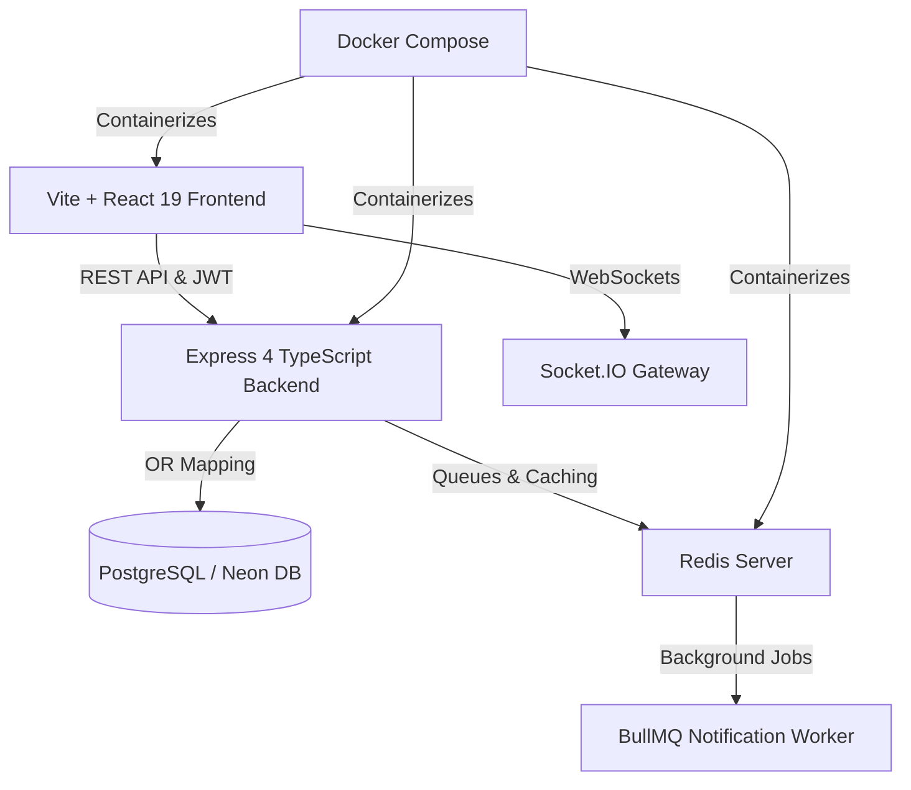

<div align="center">

  <h1>✨ NariCare ✨</h1>
  <p><strong>Cinematic Body Intelligence & Premium Menstrual Health Platform</strong></p>
  
  <p>
    
    
    
    
    
    
    
    
    
  </p>
  
  <p>
    <a href="#-quick-start"><b>Quick Start</b></a> •
    <a href="#-key-features"><b>Key Features</b></a> •
    <a href="#-tech-stack--architecture"><b>Tech Stack</b></a> •
    <a href="#-docker-deployment"><b>Docker Setup</b></a> •
    <a href="#-backend-services"><b>Backend API</b></a>
  </p>
</div>

<br />

> **NariCare** is a next-generation body-intelligence platform for menstrual health tracking. Designed with inspiration from *Apple Health*, *Oura*, and *Flo Premium*, it replaces plain spreadsheets and generic forms with an emotionally resonant, living visual sanctuary.

---

## 🌌 The Vision

Health data should feel empowering, intuitive, and deeply personal. NariCare pairs **luxury minimalism**, **ambient glassmorphism**, and **real-time biometrics** to create a seamless wellness experience.

---

## ✨ Key Features

| Feature | Description |
|---|---|
| 🔮 **Prediction Core (WebGL Orb)** | Interactive, fluid visual engine that shifts dynamically based on scroll, cycle phase, and daily biological inputs. |
| 🌸 **Cycle & Ovulation Engine** | Precision prediction algorithm computing luteal phase length, fertile window, next cycle start, and anomaly detection. |
| 📲 **Real-Time Partner Sync** | Socket.IO bi-directional WebSocket syncing allowing partners to stay informed and supportive in real-time. |
| 🔔 **Smart Notification Worker** | BullMQ + Redis background worker executing automated web push notifications and symptom reminders. |
| 🌐 **Multilingual Support (i18n)** | Native internationalization supporting English, Hindi, Tamil, Spanish, and more out of the box. |
| 🔒 **Privacy-First Architecture** | JWT authentication, bcrypt password hashing, rate-limiting, and end-to-end data isolation. |
| 🐳 **1-Click Containerized Stack** | Full Docker Compose environment orchestrating Frontend (Nginx), Express API, and Redis. |

---

## 🛠 Tech Stack & Architecture



### Frontend
- **Framework**: React 19 + TypeScript + Vite 5
- **Styling & UI**: Tailwind CSS, Framer Motion, Lucide Icons, Custom WebGL Shaders
- **Localization**: `i18next` with browser language detection
- **State & Routing**: Centralized React Context (`AppContext.tsx`), `react-router-dom`

### Backend & Infrastructure
- **Runtime**: Node.js 20 ESM/TypeScript Express server
- **Database**: PostgreSQL (Neon Cloud DB) powered by Prisma ORM
- **Queueing & Async Jobs**: BullMQ on Redis Alpine
- **Containerization**: Multi-stage Dockerfiles + Nginx static serving + Docker Compose

---

## 🚀 Quick Start

### Option A: 🐳 Docker Compose (Recommended)

Run the entire application (Frontend + Backend + Redis) with a single command:

```bash
docker compose up --build
```

Access your services:
- 🎨 **Frontend**: [http://localhost:5173](http://localhost:5173)
- ⚡ **Backend API**: [http://localhost:5000](http://localhost:5000)
- 🔴 **Redis**: `localhost:6379`

> 📄 For full container commands and environment options, read [DOCKER_SETUP.md](file:///c:/Users/sy753/Patternprinting.c/OneDrive/Documents/WEB%20Development/periods%20health%20tracker/DOCKER_SETUP.md).

---

### Option B: Local Development

#### 1. Frontend Setup
```bash
# Clone the repository
git clone https://github.com/MVPAlok/Menstrual-Health-Tracker.git
cd "periods health tracker"

# Install dependencies
npm install

# Start development server
npm run dev
```

#### 2. Backend Setup
```bash
cd backend

# Install dependencies
npm install

# Apply database migrations
npx prisma db push

# Start backend server
npm run dev
```

> 📄 For detailed database schema and API documentation, read [BACKEND_SETUP.md](file:///c:/Users/sy753/Patternprinting.c/OneDrive/Documents/WEB%20Development/periods%20health%20tracker/BACKEND_SETUP.md).

---

## 📂 Repository Structure

```text
├── 🎨 src/                    # Frontend React Application
│   ├── components/            # Orbs, Auth, Dashboard, Notification Components
│   ├── context/               # Global React App State
│   ├── i18n/                  # Multilingual locales & setup
│   ├── LandingPage.tsx        # Product Showcase Landing Page
│   └── App.tsx                # Client Routing & App Layout
│
├── ⚡ backend/                 # Real-Time Express Backend Service
│   ├── prisma/                # Database Schema & Migrations
│   ├── src/
│   │   ├── controllers/       # Auth, Log, Partner, Notification Logic
│   │   ├── routes/            # REST API Route Definitions
│   │   ├── services/          # Cycle Prediction & Report Engines
│   │   ├── queues/            # BullMQ Queue Managers
│   │   └── workers/           # Background Notification Workers
│   └── Dockerfile             # Multi-stage Backend Container Configuration
│
├── 🐳 docker-compose.yml       # Full Stack Container Orchestration
├── 🐳 Dockerfile               # Production Nginx Frontend Container
└── 📄 DOCKER_SETUP.md          # Docker Deployment Guide
```

---

<div align="center">
  <p>Crafted with ❤️ for cinematic body intelligence and modern cycle tracking.</p>
</div>

